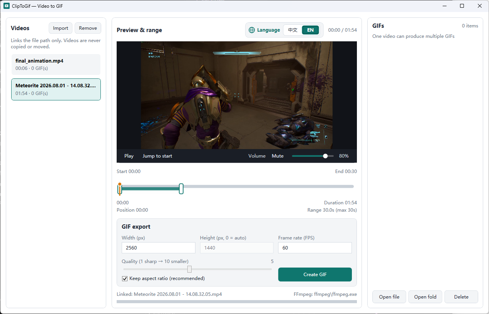
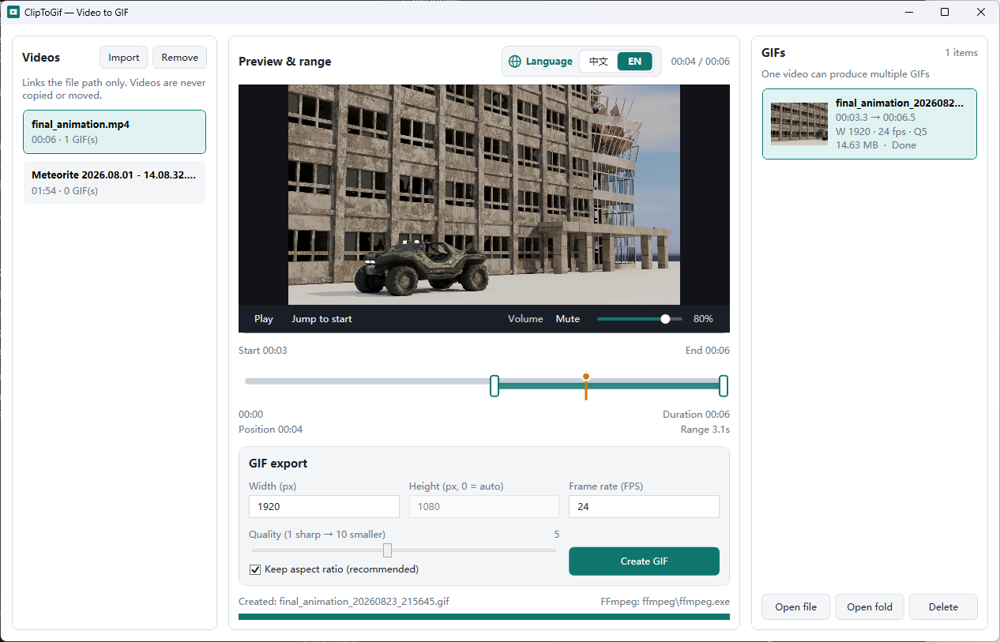

# ClipToGif

[中文说明](README.zh-CN.md)

A small Windows app that turns a video clip into one or more GIFs.

Import a video, pick a time range on the timeline, set size / FPS / quality / compression, then export. One video can produce many GIFs.



## Features

- Import or drag-and-drop videos (path links only — files are never copied or moved)
- Preview with hardware-accelerated playback (falls back to software if needed)
- Drag a range on the timeline (no duration cap)
- Export width, height, FPS, quality (1 = sharper, 10 = smaller), optional keep-aspect-ratio
- Optional GIF compression: none by default, plus several lossless and lossy algorithms
- GIF list with thumbnails: open file, open folder, delete
- Chinese / English UI
- Missing source files stay in the list and are clearly marked



## Download

Grab the latest `ClipToGif-1.2.0-win-x64.zip` from [Releases](../../releases).

Releases are published manually from the **Release** workflow. Bump `<Version>` in `ClipToGif.csproj` before running it.

Unzip and run `ClipToGif.exe`. No Visual Studio, .NET SDK, or extra FFmpeg install is required — the runtime and FFmpeg are already in the folder.

**Requires:** Windows 10/11, 64-bit.

## Usage

1. Import or drop a video on the left.
2. Play and drag the green range to choose the clip.
3. Adjust GIF size, FPS, quality, and compression.
4. Click **Create GIF**. Output appears in the list on the right.

Library data and exported GIFs live in `%LocalAppData%\ClipToGif\`.

## Build from source

```powershell
dotnet publish ClipToGif.csproj -c Release -r win-x64 --self-contained true -o publish
```

FFmpeg 7.x shared libraries must be in `ffmpeg\` (`avcodec-61.dll`, `ffmpeg.exe`, …). The GitHub Actions workflow downloads them automatically when packing a release.

## License notes

This app bundles [FFmpeg](https://ffmpeg.org/) shared binaries (GPL). See the FFmpeg project for its license terms.
